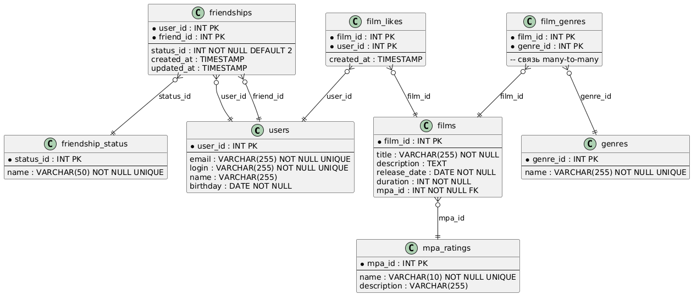

# java-filmorate
Template repository for Filmorate project.

INSERT INTO users (email, login, name, birthday)
###  Добавление нового пользователя
VALUES ('user@example.com', 'user123', 'Иван Иванов', '1990-05-15');
### Добавление нового фильма с MPA-рейтингом
INSERT INTO films (title, description, release_date, duration, mpa_id)
VALUES ('Название фильма', 'Описание фильма', '2023-01-01', 120, 1);
### Привязка жанров к фильму (связь многие-ко-многим)
-- Удалить старые связи (при обновлении)
DELETE FROM film_genres WHERE film_id = 1;

-- Добавить жанры (например, Комедия id=1 и Драма id=2)
INSERT INTO film_genres (film_id, genre_id)
VALUES (1, 1), (1, 2);
### Добавление лайка фильму
INSERT INTO film_likes (film_id, user_id)
VALUES (1, 1);
### Отправка запроса на дружбу (односторонний статус PENDING)
INSERT INTO friendships (user_id, friend_id, status_id)
VALUES (1, 2, 1);  -- статус 1 = PENDING
### Получение списка популярных фильмов (по количеству лайков)
SELECT f.film_id, f.title, f.description, f.release_date, f.duration,
m.name AS mpa_name,
COUNT(fl.user_id) AS likes_count
FROM films f
JOIN mpa_ratings m ON f.mpa_id = m.mpa_id
LEFT JOIN film_likes fl ON f.film_id = fl.film_id
GROUP BY f.film_id
ORDER BY likes_count DESC
LIMIT 10;